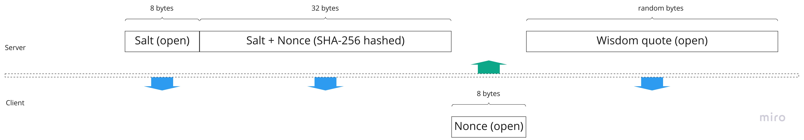

# RPC client and a server with Proof-of-Work

Test assignment: Build simple TCP server and a client.  
Protect the server from DDoS using Proof-of-Work algorithm.

## Proof of work principle

- Server generates 16-bytes sized Block
- Block includes a Salt and a Nonce (both 8-bytes sized)
- Block is being hashed using SHA-256 algo (32-bytes sized sequence as a result)
- Salt and a result of hashing are being sent to the Client as a puzzle
- Client must solve this puzzle and find Nonce calculating SHA-256 hashes from the known Salt and sequentially chosen number
- If puzzle solved, received and validated by the Server - Client will get a Wisdom Quote



## FAQ:

Q: What is Proof of Work how it linked to DDoS problem?
A: The answer is [here](https://en.wikipedia.org/wiki/Proof_of_work)

Q: Why do we need a Salt?
A: To prevent [Rainbow tables attack](https://en.wikipedia.org/wiki/Rainbow_table)

## Project structure

```
.
├── assets
│   ├── assets.go
│   ├── assets_test.go
│   └── data
│       └── quotes.txt    <-- wisdom quotes list
├── cmd
│   ├── client.go
│   ├── config.go
│   ├── root.go
│   └── server.go
├── Dockerfile
├── go.mod
├── go.sum
├── internal
│   ├── call
│   │   ├── caller.go
│   │   └── opts.go
│   └── serve
│       ├── mocks
│       │   └── ConnHandler.go
│       ├── opts.go
│       ├── server.go
│       ├── server_test.go    <-- most of tests are here
│       └── types.go
├── main.go
├── Makefile
├── pkg
│   ├── pow
│   │   ├── pow.go    <-- proof of work package
│   │   └── pow_test.go
│   └── zaplog
│       └── zaplog.go
├── README.md
└── rpc_scheme.jpg
```

## Execution

Just say `make` to download all the dependencies, run tests and build a docker container for both client and server.

To run server:  
`$ make server`

To run client:  
`$ make client`
